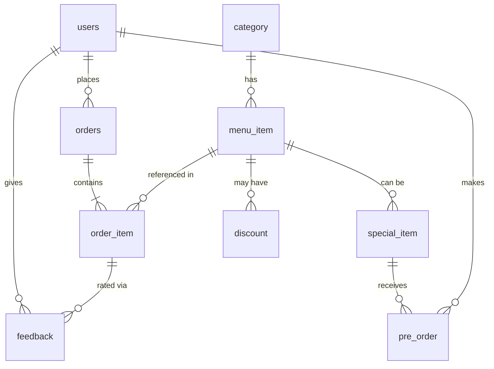

# 🍽️ UIU Smart Canteen Ordering System

A full-stack **digital canteen management system** built for United International University (UIU). Students can browse menus, place orders, and track them in real-time with a token system — similar to Foodpanda. Staff can manage incoming orders through a Kanban-style board, and Admins have a full analytics dashboard.

**Tech Stack:** PHP · MySQL · Bootstrap 5 · JavaScript (Vanilla) · XAMPP

---

## 📁 Project Structure

```
Smart Canteen Ordering System/
│
├── index.php                    # Landing page — role selection (Student / Staff / Admin)
├── launch_canteen.bat           # Windows batch launcher to start PHP dev server
├── README.md                    # This file
│
├── includes/                    # Shared backend logic
│   ├── db.php                   # Database connection (mysqli)
│   ├── login.php                # Login handler (POST) — authenticates & redirects by role
│   ├── register_process.php     # Registration handler (POST) — creates new student accounts
│   ├── auth.php                 # Session guard — require_login() & require_role() helpers
│   └── logout.php               # Destroys session, redirects to index.php
│
├── student/                     # Student portal
│   ├── login.php                # Student login form UI
│   ├── register.php             # Student sign-up form UI
│   ├── dashboard.php            # Main menu — shows all food items from DB with add-to-cart
│   ├── breakfast.php            # Filtered view — Breakfast items (static)
│   ├── snacks.php               # Filtered view — Snacks items (static)
│   ├── fast_food.php            # Filtered view — Fast Food items (static)
│   ├── rice.php                 # Filtered view — Rice items (static)
│   ├── drinks.php               # Filtered view — Drinks items (static)
│   ├── deals.php                # Filtered view — Deals (placeholder)
│   ├── special.php              # Filtered view — Special pre-order items (static)
│   ├── add_to_cart.php          # POST handler — adds item to session cart
│   ├── remove_from_cart.php     # POST handler — removes item from session cart
│   ├── view_cart.php            # Cart page — shows items, quantities, total & place order
│   ├── checkout.php             # POST handler — creates order, generates token, redirects
│   ├── order_tracking.php       # Live order tracking page with progress steps & token popup
│   ├── get_order_status.php     # AJAX JSON endpoint — returns current order status
│   └── my_orders.php            # Order history — lists all past orders with track buttons
│
├── staff/                       # Staff portal
│   ├── login.php                # Staff login form UI
│   ├── dashboard.php            # Kanban board — Pending → Preparing → Ready → Picked Up
│   └── update_order.php         # POST handler — updates order status
│
├── admin/                       # Admin portal
│   ├── login.php                # Admin login form UI
│   └── dashboard.php            # Admin analytics dashboard (sales, reports, menu mgmt)
│
└── assets/                      # Static frontend assets
    ├── css/
    │   ├── style.css            # Landing page styles
    │   ├── student_style.css    # Student dashboard & menu pages styles
    │   ├── student_login.css    # Login / Register page styles
    │   ├── staff.css            # Staff dashboard styles
    │   ├── staff_login.css      # Staff login styles
    │   ├── admin_login.css      # Admin login styles
    │   └── admin_dashboard.css  # Admin dashboard styles
    ├── js/
    │   └── script.js            # Legacy JS (background slider, smooth scroll)
    └── images/                  # Food item images (burger.jpg, Kacchi.jpg, etc.)
```

---

## 🗄️ Database Schema (`smart_canteen`)

The system uses a **MySQL** database named `smart_canteen` with **9 tables**:

### Entity-Relationship Overview



### Table Details

#### `users`
| Column    | Type                              | Key | Notes                        |
|-----------|-----------------------------------|-----|------------------------------|
| user_id   | INT(11) AUTO_INCREMENT            | PK  |                              |
| username  | VARCHAR(50) NOT NULL              | UNI | Unique login name            |
| password  | VARCHAR(255) NOT NULL             |     | Plain text (for lab project) |
| role      | ENUM('student','staff','admin')   |     | Determines portal access     |
| name      | VARCHAR(100)                      |     | Full name                    |
| email     | VARCHAR(100)                      |     | Contact email                |

#### `category`
| Column      | Type                   | Key | Notes          |
|-------------|------------------------|-----|----------------|
| category_id | INT(11) AUTO_INCREMENT | PK  |                |
| name        | VARCHAR(100) NOT NULL  |     | e.g. Breakfast |

#### `menu_item`
| Column       | Type                   | Key | Notes                          |
|--------------|------------------------|-----|--------------------------------|
| item_id      | INT(11) AUTO_INCREMENT | PK  |                                |
| category_id  | INT(11)                | FK  | → category.category_id         |
| name         | VARCHAR(100)           |     | Item display name              |
| price        | DECIMAL(10,2)          |     | Price in BDT (৳)               |
| image_url    | VARCHAR(255)           |     | Filename in assets/images/     |
| quantity     | INT(11)                |     | Available stock                |
| is_available | TINYINT(1) DEFAULT 1   |     | Toggle by staff                |
| is_special   | TINYINT(1) DEFAULT 0   |     | Marks pre-order items          |

#### `orders`
| Column         | Type                   | Key | Notes                            |
|----------------|------------------------|-----|----------------------------------|
| order_id       | INT(11) AUTO_INCREMENT | PK  |                                  |
| user_id        | INT(11)                | FK  | → users.user_id                  |
| order_date     | DATETIME DEFAULT NOW() |     | Auto-set on insert               |
| status         | VARCHAR(50)            |     | Pending → Preparing → Ready → Picked Up |
| total_amount   | DECIMAL(10,2)          |     | Sum of all items × quantity      |
| payment_status | VARCHAR(50)            |     | Unpaid / Paid                    |
| token_number   | VARCHAR(50)            |     | e.g. T-0001 — shown to student  |
| pickup_time    | DATETIME               |     | Set when status = Picked Up      |
| ready_time     | DATETIME               |     | Set when status = Ready          |
| cancel_time    | DATETIME               |     | Set if order cancelled           |
| is_cancelled   | TINYINT(1) DEFAULT 0   |     | Cancellation flag                |
| tip_amount     | DECIMAL(10,2)          |     | Optional tip                     |

#### `order_item`
| Column        | Type                   | Key | Notes                    |
|---------------|------------------------|-----|--------------------------|
| order_item_id | INT(11) AUTO_INCREMENT | PK  |                          |
| order_id      | INT(11)                | FK  | → orders.order_id        |
| item_id       | INT(11)                | FK  | → menu_item.item_id      |
| quantity      | INT(11)                |     | How many of this item    |
| unit_price    | DECIMAL(10,2)          |     | Price at time of order   |

#### `special_item`
| Column             | Type                   | Key | Notes                      |
|--------------------|------------------------|-----|----------------------------|
| special_id         | INT(11) AUTO_INCREMENT | PK  |                            |
| item_id            | INT(11)                | FK  | → menu_item.item_id        |
| available_date     | DATE                   |     | When it will be available  |
| min_orders         | INT(11)                |     | Minimum pre-orders needed  |
| current_preorders  | INT(11)                |     | Current count              |
| is_active          | TINYINT(1) DEFAULT 1   |     |                            |
| created_by         | INT(11)                | FK  | → users.user_id (admin)    |

#### `pre_order`
| Column        | Type                   | Key | Notes                  |
|---------------|------------------------|-----|------------------------|
| preorder_id   | INT(11) AUTO_INCREMENT | PK  |                        |
| special_id    | INT(11)                | FK  | → special_item         |
| user_id       | INT(11)                | FK  | → users.user_id        |
| preorder_date | DATE                   |     |                        |
| status        | VARCHAR(50)            |     |                        |

#### `discount`
| Column      | Type                   | Key | Notes               |
|-------------|------------------------|-----|---------------------|
| discount_id | INT(11) AUTO_INCREMENT | PK  |                     |
| item_id     | INT(11)                | FK  | → menu_item.item_id  |
| percentage  | FLOAT                  |     | Discount %           |
| is_active   | TINYINT(1) DEFAULT 1   |     |                     |
| created_by  | INT(11)                | FK  | → users.user_id      |

#### `feedback`
| Column        | Type                     | Key | Notes                   |
|---------------|--------------------------|-----|-------------------------|
| feedback_id   | INT(11) AUTO_INCREMENT   | PK  |                         |
| user_id       | INT(11)                  | FK  | → users.user_id          |
| order_item_id | INT(11)                  | FK  | → order_item             |
| rating        | INT(11)                  |     | 1-5 stars                |
| comment       | TEXT                     |     | Written feedback         |
| created_at    | DATETIME DEFAULT NOW()   |     |                         |

---

## ⚙️ How It Works — File Interaction Flow

### 1. Database Connection

All database access goes through **`includes/db.php`**:

```php
$conn = mysqli_connect("localhost", "root", "", "smart_canteen");
```

Every PHP page that needs the database includes this file with `require_once '../includes/db.php'`.

### 2. Authentication Flow

```
index.php (role selection)
    ├─→ student/login.php  ──POST──→ includes/login.php ──→ student/dashboard.php
    ├─→ staff/login.php    ──POST──→ includes/login.php ──→ staff/dashboard.php
    └─→ admin/login.php    ──POST──→ includes/login.php ──→ admin/dashboard.php
```

- **`includes/login.php`** — Receives `username`, `password`, and `role` via POST. Queries the `users` table, sets `$_SESSION['user_id']`, `$_SESSION['username']`, and `$_SESSION['role']`, then redirects based on role.
- **`includes/auth.php`** — Provides two guard functions:
  - `require_login()` — Redirects to `index.php` if not logged in.
  - `require_role($role)` — Blocks access if session role doesn't match.
- **`includes/logout.php`** — Destroys session, redirects to `index.php`.

### 3. Student Registration

```
student/login.php ──→ student/register.php ──POST──→ includes/register_process.php
                                                        ├── Checks for duplicate username/email
                                                        └── INSERTs into users table with role='student'
```

### 4. Student Ordering Flow

```
student/dashboard.php          ← Shows all menu_item rows from DB
       │
       ├─ Click "+" ──POST──→ student/add_to_cart.php
       │                        └── Adds item_id to $_SESSION['cart']
       │
       ├─ Cart icon ──→ student/view_cart.php
       │                   ├── Reads $_SESSION['cart']
       │                   ├── Queries menu_item for each item_id
       │                   ├── Shows items, quantities, totals
       │                   └── "Place Order" button
       │
       └─ Place Order ──POST──→ student/checkout.php
                                  ├── Calculates total from cart
                                  ├── Generates token (T-0001)
                                  ├── INSERTs into orders table
                                  ├── INSERTs each item into order_item table
                                  ├── Clears $_SESSION['cart']
                                  └── Redirects to order_tracking.php?new=1
```

### 5. Token System

When an order is placed:
1. **`checkout.php`** generates a token like `T-0001` (based on MAX order_id + 1)
2. Saves it to the `orders.token_number` column
3. Redirects to `order_tracking.php` with `?new=1` flag
4. On first load, a **dark-themed modal popup** displays the token number prominently
5. Student dismisses the popup and sees the live tracking page

### 6. Real-Time Order Tracking (Like Foodpanda)

```
student/order_tracking.php
       │
       ├── Shows 4-step progress: Order Placed → Preparing → Ready → Picked Up
       ├── Animated green progress bar connecting the steps
       ├── Pulsing animation on the current active step
       │
       └── Every 5 seconds, JavaScript calls:
           student/get_order_status.php?order_id=X
              └── Returns JSON: { success: true, status: "Preparing" }
                     └── JS updates the progress tracker without page reload
```

### 7. Staff Order Management

```
staff/dashboard.php
       │
       ├── Kanban board with 3 columns: Pending | Preparing | Ready
       ├── Each order card shows: Order #, Token, Amount
       │
       └── Staff clicks "Move to Preparing" / "Move to Ready" / "Mark Picked Up"
              ──POST──→ staff/update_order.php
                          ├── UPDATE orders SET status = '...' WHERE order_id = X
                          ├── Sets ready_time when → Ready
                          ├── Sets pickup_time when → Picked Up
                          └── Redirects back to dashboard.php
```

When staff updates the status, the student's tracking page **auto-updates within 5 seconds** via AJAX polling.

---

## 🚀 How to Run

### Prerequisites
- **XAMPP** installed (Apache + MySQL)

### Steps

1. **Start XAMPP** — Run Apache and MySQL from the XAMPP Control Panel.

2. **Import the database:**
   - Open `http://localhost/phpmyadmin`
   - Create a database named `smart_canteen`
   - Import the SQL file (or create tables matching the schema above)

3. **Place the project** in your XAMPP `htdocs` folder:
   ```
   <xampp>/htdocs/Smart Canteen Ordering System/
   ```

4. **Open in browser:**
   ```
   http://localhost/Smart%20Canteen%20Ordering%20System/index.php
   ```

   Or double-click `launch_canteen.bat` to auto-start the PHP server.

### Default Test Accounts
Register a new student via the sign-up form, or manually insert users:

```sql
INSERT INTO users (username, password, role, name, email) VALUES
('admin1', 'admin123', 'admin', 'Admin User', 'admin@uiu.ac.bd'),
('staff1', 'staff123', 'staff', 'Staff User', 'staff@uiu.ac.bd'),
('student1', '123456', 'student', 'Test Student', 'student@uiu.ac.bd');
```

---

## 📋 Key Features

| Feature | Status |
|---------|--------|
| Role-based landing page (Student / Staff / Admin) | ✅ |
| Student registration & login | ✅ |
| Dynamic menu from database | ✅ |
| Category-filtered pages (Breakfast, Snacks, etc.) | ✅ |
| Session-based shopping cart | ✅ |
| Order placement with token generation | ✅ |
| Token popup modal on checkout | ✅ |
| Real-time order tracking (AJAX polling) | ✅ |
| Staff Kanban order board | ✅ |
| Staff order status management | ✅ |
| Admin analytics dashboard | ✅ |
| Pre-order system for special items | 🔧 Partial |
| Discount management | 🔧 Schema ready |
| Feedback/rating system | 🔧 Schema ready |

---

## 👥 Roles

| Role    | Access                                                        |
|---------|---------------------------------------------------------------|
| Student | Browse menu, add to cart, place orders, track orders, view history |
| Staff   | View Kanban board, move orders through stages                  |
| Admin   | Sales reports, menu management, analytics                      |

---

*Built as a DBMS Lab project — UIU, 7th Trimester*
